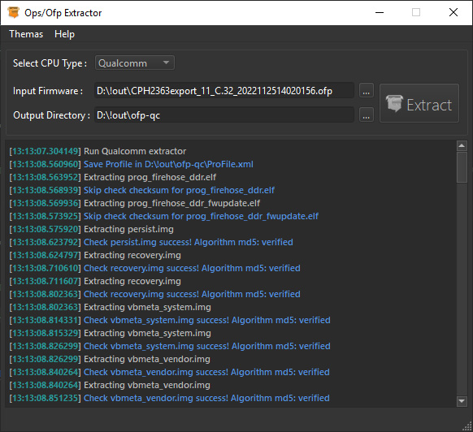
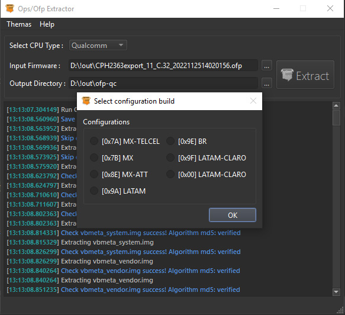
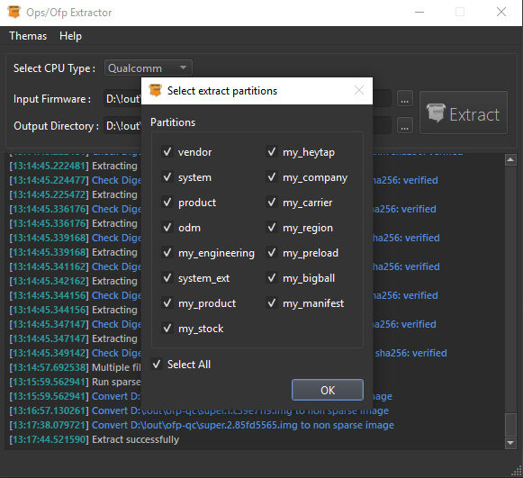
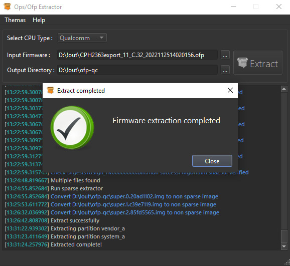

# OppoDecrypt
Oppo .ofp and Oneplus .ops Firmware decrypter

Installation:
-------------
- Install >= python 3.10 

Install poetry:
-------------
### Linux, macOS, Windows (WSL)
```bash
curl -sSL https://install.python-poetry.org | python3 -
```

### Windows (Powershell)
```powershell
(Invoke-WebRequest -Uri https://install.python-poetry.org -UseBasicParsing).Content | py -
```

In the console, run
```bash
poetry install
```

Usage CLI:
-------- 
* Extract ops/ofp file:

```
python3 OppoDecrypt --cpu {qualcomm,mtk} [--debug | --no-debug] [--sparse | --no-sparse] [file.ofp | file.ops] [directory to extract]
```

Run GUI:
-------- 
* Extract ops/ofp file:

```
python3 OppoDecrypt --gui
```

GUI:
--------





Thanks:
-------- 
- [Bjoern Kerler](https://github.com/bkerler)